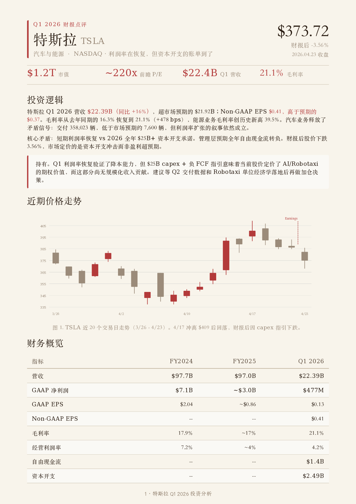
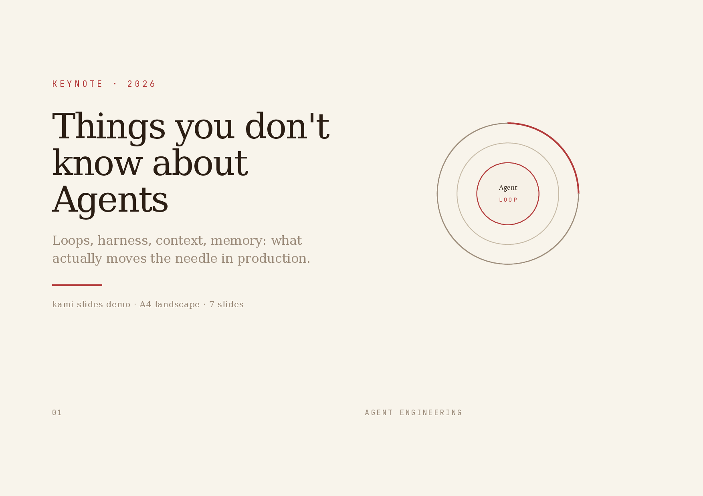
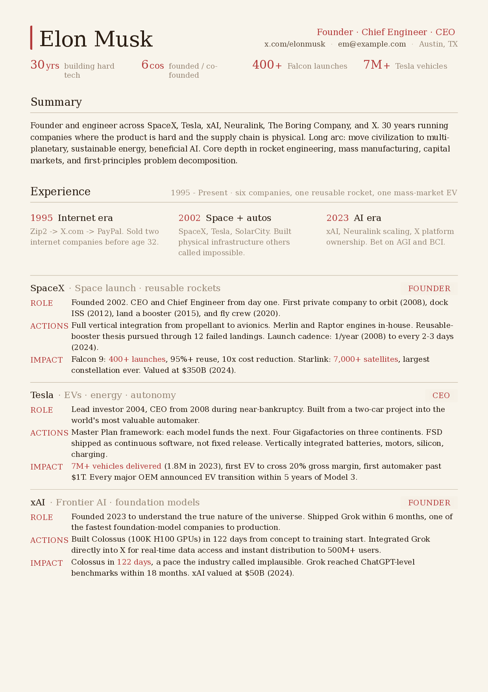
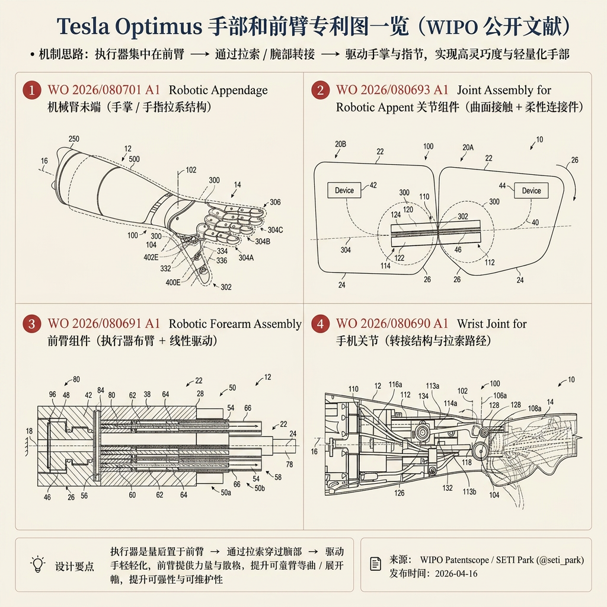
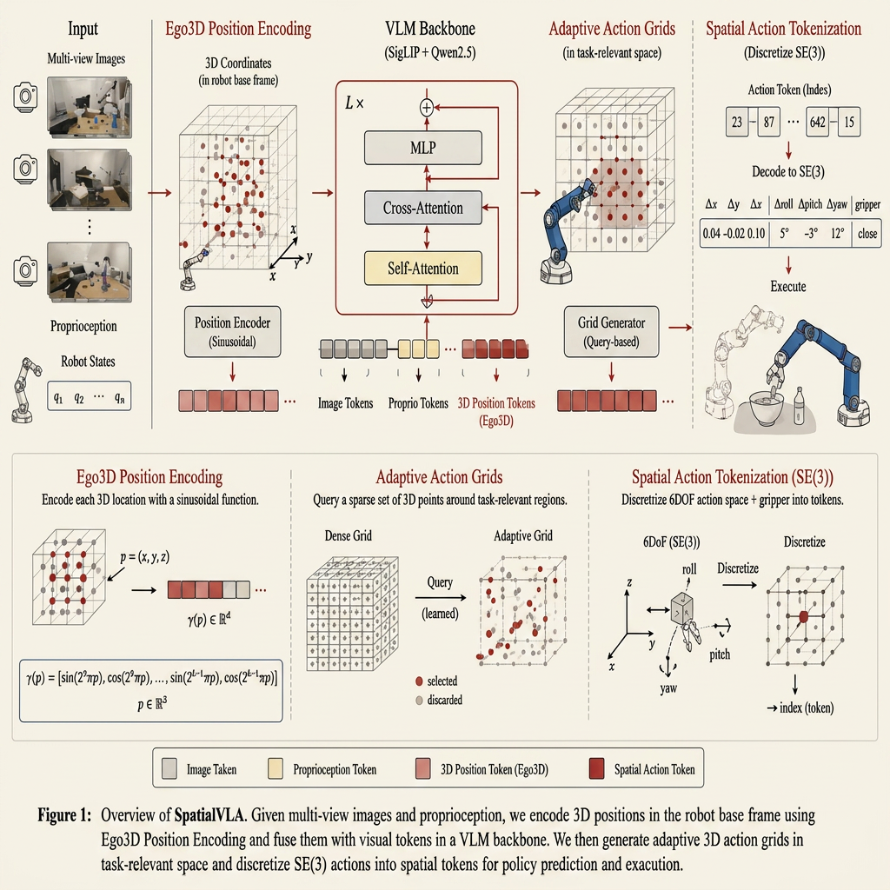
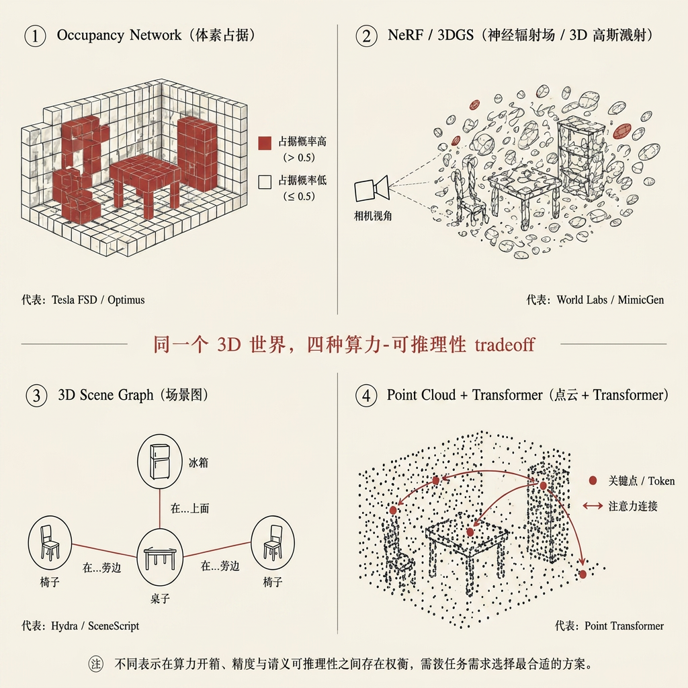

  <h1>InkPaper</h1>
  
<b>Good content deserves good paper.</b>

  
  
  
  

## See it

<table>
<tr>
  <td align="center" width="25%">
    
     <b>Equity Report</b> · 中文
     Tesla Q1 2026 财报点评
  </td>
  <td align="center" width="25%">
    
     <b>Slides</b> · English
     Agent keynote, 6 slides
  </td>
  <td align="center" width="25%">
    
     <b>Resume</b> · English
     Founder CV, 2 pages
  </td>
</tr>
</table>

## Design

Warm paper canvas, ink blue as the sole accent, serif carries hierarchy, no hard shadows or flashy palettes. Not a UI framework; a constraint system for printed matter. Documents should read as composed pages, not dashboards.

Eight document types (One-Pager, Long Doc, Letter, Portfolio, Resume, Slides, Equity Report, Changelog) with dedicated EN/CN templates. Fourteen inline SVG diagram types included. InkPaper picks the right variant based on the language you write in.

| Element     | Rule                                                                            |
| ----------- | ------------------------------------------------------------------------------- |
| Canvas      | `#F8F4EB` paper, never pure white                                               |
| Accent      | Ink blue `#B33A3A` only, no second chromatic hue                                |
| Neutrals    | All warm-toned (yellow-brown undertone), no cool blue-grays                     |
| Serif       | Body 400, headings 500. Avoid synthetic bold                                    |
| Line-height | Tight titles 1.1-1.3, dense body 1.4-1.45, reading body 1.5-1.55                |
| Shadows     | Ring or whisper only, no hard drop shadows                                      |
| Tags        | Solid hex backgrounds only. `rgba()` triggers a WeasyPrint double-rectangle bug |

**Fonts**: Each language uses a single serif font for the entire page. Chinese: TsangerJinKai02. English: Charter. TsangerJinKai is free for personal use, commercial use requires a license from [tsanger.cn](https://tsanger.cn). All other fonts are system-bundled.

Full spec: [design.md](references/design.md). Cheatsheet: [CHEATSHEET.md](CHEATSHEET.md).

## Travel

The same constraint system doubles as a brief you can hand to any drawing tool. Point it at the [references folder](references/) and the output inherits warm paper, cinnabar restraint, single-line geometric icons, and editorial typography.

> Apply the InkPaper design system from github.com/Fize/InkPaper/tree/main/references

<table>
<tr>
  <td align="center" width="33%">
    
     <b>Evidence layout</b> · 中文
     Tesla Optimus 手部和前臂专利图一览
  </td>
  <td align="center" width="33%">
    
     <b>Architecture redraw</b> · English
     SpatialVLA Figure 1, schematic
  </td>
  <td align="center" width="33%">
    
     <b>Concept tradeoff</b> · 中文
     3D 表示的算力-推理性取舍
  </td>
</tr>
</table>

Rendered by ChatGPT Images 2.0 in a single pass with no manual touch-up. InkPaper specifies, the renderer draws.

## Background

I like investing in US equities and ask Claude to write research reports all the time. Every output landed in the same default-doc look: gray, flat, a different layout each session. The structure was hard to scan, the formatting felt dated, and nothing about the page made me want to keep reading. So I started fixing the typography, the palette, the spacing, one rule at a time, until the report became a page I actually enjoyed.

Later I needed to present "The Agent You Don't Know: Principles, Architecture and Engineering Practice." I already had the document and didn't want to build slides from scratch, so I used Claude Design to lay it out in my own style, tweaked it round after round, and eventually got it to a place I was happy with. That process added inline SVG charts, a unified warm palette, and a tighter editorial rhythm. It kept growing until it covered every document I regularly ship, so I kept abstracting the process, and it became inkpaper: one quiet design system I can hand to any agent and trust the output.

## License

MIT License for inkpaper code and templates. Feel free to use and contribute.

**Fonts**: TsangerJinKai02 (Chinese) is free for personal use only; commercial use requires a license from [tsanger.cn](https://tsanger.cn). Charter (English), and CJK fallbacks are system-bundled or open-licensed.
